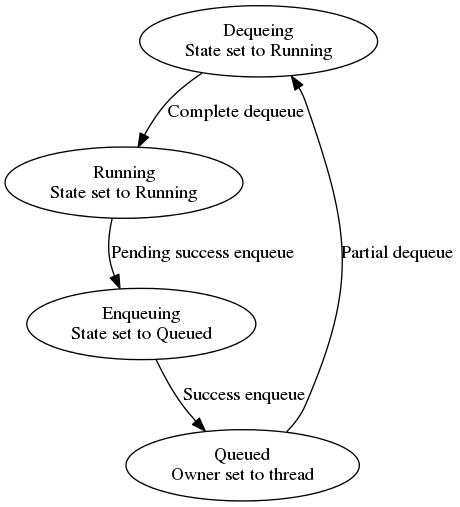

**class Scheduler**

The scheduler has two basic operations for Process:

- `SpawnProcess` - Spawn a new process and enqueue it on a thread.
- `SendToProcess` - While executing a process, attempt to wake up a target
  process on the current thread. Returns the process the thread should continue
  to execute immediately - or Null if next in queue.

*Fields*

* `Array Threads` - Non-growable list of `Thread`s.
* `Stack IdleThreads` - List of idle `Thread`s.

```python
SpawnProcess() {
  P <- new Process()
  EnqueueOnAnyThread(P)
}
```

```python
SendToProcess(Current, Target) {
  if Target.ChangeState(Sleeping, Running) {
    Current.ChangeState(Running, Queued)
    EnqueueOnAnyThread(Current)
    return Target
  } else {
    TargetThread <- Target.OwnerThread
    if TargetThread != Null and TargetThread.TryDequeueEntry(Target) {
      Current.ChangeState(Running, Queued)
      EnqueueOnAnyThread(Current)
      return Target
    }
  }
  Current.ChangeState(Running, Queued)
  EnqueueOnAnyThread(Current)
  return Null
}
```

```python
RunThread(T) {
  while True {
    T.Wait()
    while True {
      P <- DequeueFromThread(T)
      while P != Null: P <= Execute(P)
    }
  }
}
```

```python
Execute(P)
  # May call SpawnProcess and SendToProcess.
```

```python
EnqueueOnAnyThread(P) {
  if TryEnqueueOnIdleThread(P): return True
  while True {
    for T in Threads {
      Empty <- T.IsEmpty()
      if T.TryEnqueue(P) {
        if Empty: T.Wakeup(): return False
      }
    }
  }
}
```

```python
TryEnqueueOnIdleThread(P) {
  while True {
    T <- IdleThreads.Pop()  # Is really a CAS, linked-list through Threads
    if T = Null: return False
    if !T.TryEnqueue(P): continue
    T.Wakeup()
    return True
  }
}
```

```python
TryDequeueFromAnyThread() {
  for each T in Threads {
    Success, P <- T.TryDequeue()
    if P != Null: return P;
  }
  return Null;
}
```

```python
DequeueFromThread(T) {
  while True {
    Success, P <- T.TryDequeue()
    if Success: return P
    P <- TryDequeueFromAnyThread()
    if P != Null: return P
  }
}
```

**class Thread**

Each Thread has a queue of scheduled processes, with 3 simple commands:


- `TryEnqueue` - Try to enqueue a Process to the end of the queue.
- `TryDequeue` - Try to dequeue the head element of the queue.
- `TryDequeueEntry` - Try to dequeue a specific P from the queue.

_Fields_

- `Atomic<Process> Head` - Head of queue
- `Atomic<Process> Tail` - Tail/end of queue
- `Process Sentinel` - Non-Null & unique Process value.
- `Monitor IdleMonitor`

_Members_

```python
TryEnqueue(P) {
  INVARIANT(P.State = Queued)
  H <- Head
  while True {
    if H = Sentinel: return False
    if Head.CompareAndSwap(H, Sentinel): break
    H <- Head
  }
  P.OwnerThread <- This
  if H != Null {
    Tail.Next <- P
    P.Previous <- Tail
    Tail <- P
    Head <- H
  } else {
    Tail <- P
    Head <- P
  }
  return True
}
```

```python
TryDequeue() {
  H <- Head
  while True {
    if H = Sentinel: return False, Null
    if H = Null: return True, Null
    if Head.CompareAndSwap(H, Sentinel): break
    H <- Head
  }
  INVARIANT(H unreachable from other threads)
  if Tail = H: Tail <- Null
  Next <- H.Next
  if next != Null: Next.Previous <- Null
  H.ChangeState(Queued, Running)
  H.OwnerThread <- Null
  H.Next <- Null
  Head <- Next;
  return True, H
}
```

```python
TryDequeueEntry(P)
  H <- Head
  while True {
    if H = Sentinel or H = Null: return False
    if Head.CompareAndSwap(H, Sentinel): break
    H <- Head
  }
  if P.OwnerThread != This or !P.ChangeState(Queued, Running) {
    Head <- H
    return False
  }
  INVARIANT(P unreachable from other threads)
  if H = P {
    if H = Tail: Tail <- Null
    Head <- Head.Next
  } else {
    Next <- P.Next
    Previous <- P.Previous
    Previous.Next <- Next
    if Next = Null {
      Tail <- Prev
    } else {
      Next.Previous <- Previous
    }
  }
  P.OwnerThread <- Null
  P.Next <- Null
  P.Previous <- Null
  Head <- H
  return True
}
```

```python
IsEmpty {
  return Head = Null;
}
```

```python
Wakeup() {
  # The 'value' changed under the lock is an insertion into the queue.
  IdleMonitor.Lock();
  IdleMonitor.Notify();
  IdleMonitor.Unlock();
}
```

```python
Wait() {
  IdleMonitor.Lock();
  while IsEmpty: IdleMonitor.Wait();
  IdleMonitor.Unlock();
}
```

**class Process**

The process transition in state as follows:



*Fields*

- `Atomic<Thread> OwnerThread`
- `Atomic<Process> Next`
- `Atomic<Process> Previous`
- `Atomic<Queued|Running> State`

```python
ChangeState(From, To) {
  if From = Running {
    INVARIANT(State = Running)
    State <- To
    return True
  }
  S <- State
  while S = From {
    if State.CompareAndSwap(S, To): return True
    S <- State
  }
  return False
}
```
